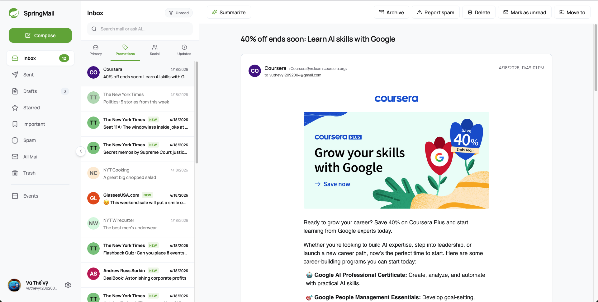
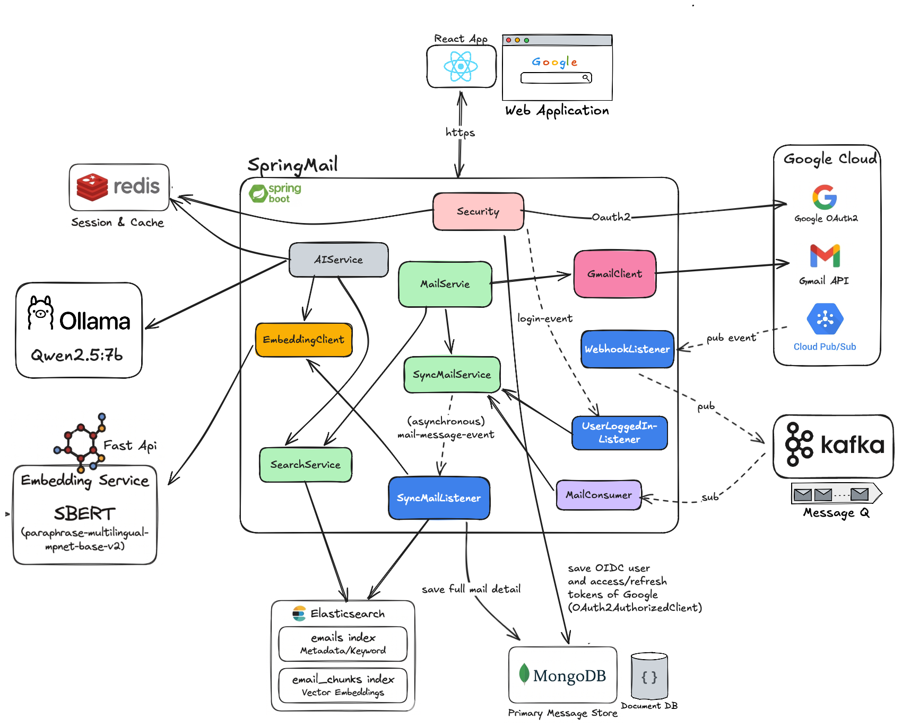
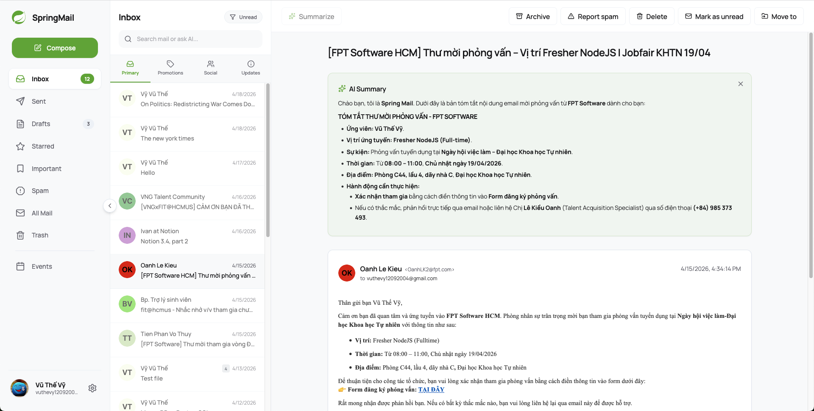
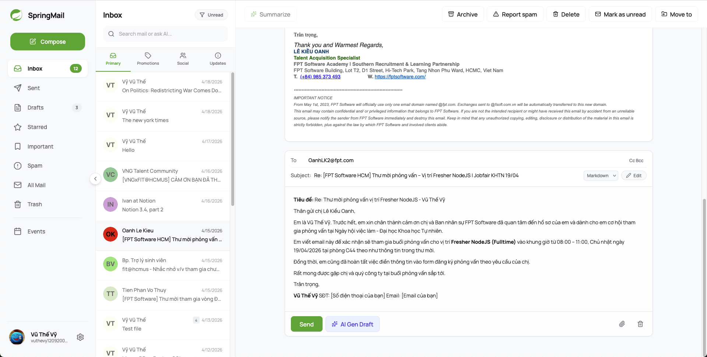
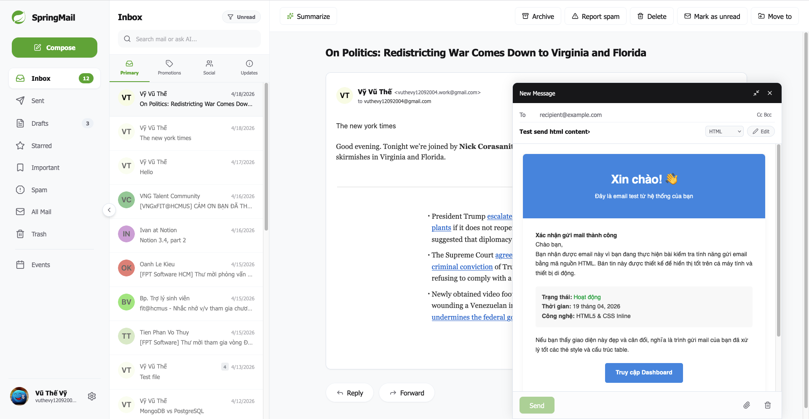

# SpringMail

<div align="center">
  
  <h2>SpringMail - Intelligent Email Client</h2>
  <p align="center">
    
    
    
    
    
    
    
  </p>
  <p>A modern, efficient email application integrated with AI to make email management and search smarter.</p>
</div>

---
## Tech Stack

- **Spring Boot 3.x** (Java 21, Spring AI, OAuth2)
- **React 19** (TypeScript, Vite, Tailwind CSS)
- **SentenceTransformers** (SBERT: `paraphrase-multilingual-mpnet-base-v2`)
- **Elasticsearch** (Hybrid Search Engine)
- **MongoDB** (Primary Data)
- **Redis** (Session & Caching)

---

## Embedding Service (SBERT)

The embedding service is a small FastAPI app that serves SBERT vectors for semantic search.

### Run locally (macOS, Python 3.9+)

```bash
cd embedding-service
python3 -m venv .venv
source .venv/bin/activate
pip install fastapi uvicorn sentence-transformers
uvicorn sbrert:app --host 0.0.0.0 --port 8001
```

### Test

```bash
curl -X POST http://localhost:8001/embed \
  -H "Content-Type: application/json" \
  -d '{"text":"Hello world"}'
```

Notes:
- First run will download the model `paraphrase-multilingual-mpnet-base-v2`.
- If you hit a missing `torch` error, install it: `pip install torch`.

---

## Application Overview

**SpringMail** is a modern email management platform that provides all the features of a traditional email application, empowered by the integration of **Large Language Models (LLMs)**. The application optimizes user workflows through intelligent summarization, smart responses, and deep semantic search.

<p align="center">
  
</p>

## System Architecture

The system is built on **Spring Boot**, integrating with **Gmail API** and **Google OAuth2** for data synchronization. We use **MongoDB** for primary storage and **Redis** for stateful session management and caching. Searching is powered by **Elasticsearch** with a hybrid approach: traditional **Full-text search** and **Vector search** (using **SBERT** for text embedding).

<p align="center">
  
</p>

---

## Key Features

### 1. Smart Hybrid Search
Leveraging the core power of **Elasticsearch** combined with the `paraphrase-multilingual-mpnet-base-v2` model from **SBERT**, we have built a comprehensive email search engine. By synchronizing **Full-text Search** and **Vector Search**, the system can process queries based on user intent rather than just character matching. It specifically offers optimized support for Vietnamese, enabling precise data retrieval based on **Semantic Similarity**, ultimately optimizing workflow efficiency and information management.

- **Hybrid Search Interface:** A seamless blend of traditional keyword matching and AI-powered semantic understanding.
  <p align="center">
    
  </p>

### 2. Automatic Event Grouping
The application automatically analyzes and groups emails related to the same event, helping you track workflows more efficiently.

- **Smart Event Aggregation:** Automatically identifies and categorizes emails belonging to the same project or event, allowing you to manage complex workloads with ease.
  <p align="center">
    
  </p>
- **Contextual Timeline:** Navigate through all communications related to a specific event in a unified view, ensuring no detail is ever lost.
  <p align="center">
    
  </p>

### 3. Powerful AI Assistant

- **Email Summarization:** AI helps you capture the main content of long email threads in seconds.
  <p align="center">
    
  </p>
- **Draft Generation:** Automatically generate professional email drafts based on the conversation context.
  <p align="center">
    
  </p>

### 4. Advanced Content Support (Markdown & HTML)
Support for composing and sending emails using both **Markdown** and **HTML** formatting. Seamlessly handle rich content, embedded images, and attachments for a versatile communication experience.

- **Markdown & HTML Editor:** Compose beautiful emails using Markdown and see the results instantly in a rich-text format.
- **Rich Media Support:** Easily embed images and formatted attachments into your professional communications.
  <p align="center">
    
  </p>